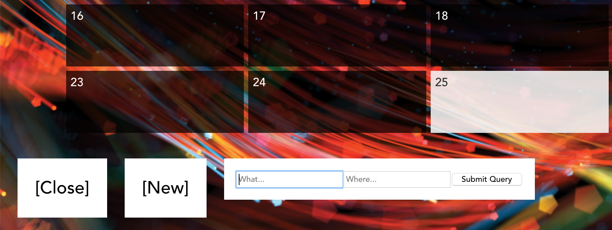

This is a simple calendar with an event system, made purely in vanilla JavaScript.

The calendar is made by 

- finding the current date
- using this date to get the current month
- find the first day of the month 
- make date squares for the each day until the the first day of the next month

This process is repeated when changing months, so that every month's squares are drawn sequentially from the first to the last.

Clicking on a specific date shows you all the events happening on that day, including the name and location, plus a button to create new events.

When an event is made, a fetch request is sent to the backend. (The repo for the backend [can be found here](https://github.com/astrosquid/mod3-final-project).) Once the request is done, the number of events will show on the date they were made.

